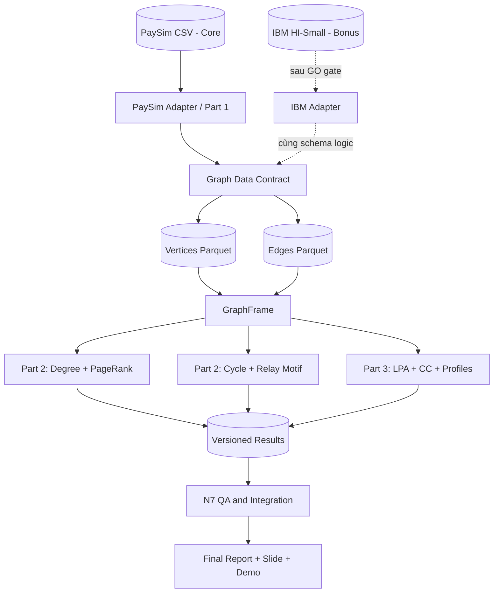
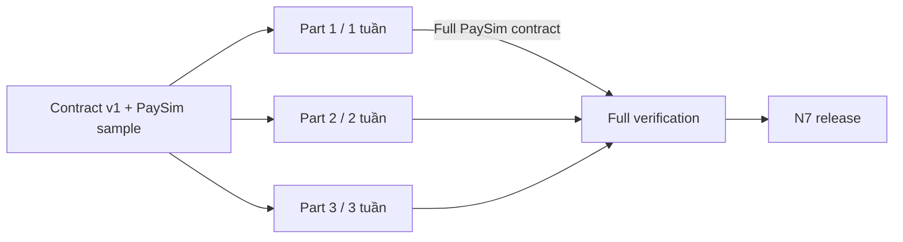
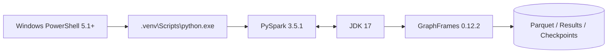

# GraphGuard — Distributed Graph Analytics for Anti-Money Laundering

> Tài liệu mục tiêu, hướng nghiên cứu và kiến trúc dự án Nhóm 6
>
> Core dataset: PaySim · Bonus dataset: IBM Transactions for AML — HI-Small
>
> Thời gian: 21/09/2026–25/10/2026

## 1. Dự án làm gì?

GraphGuard phân tích giao dịch tài chính dưới dạng **đồ thị có hướng và có thuộc tính**:

- vertex là tài khoản;
- edge là một giao dịch từ tài khoản nguồn tới tài khoản đích;
- edge giữ số tiền, thời gian, loại giao dịch và nhãn fraud/laundering;
- GraphFrames/PySpark xử lý hàng triệu giao dịch bằng DataFrame phân tán.

Dự án không xây một mô hình tự động kết luận ai rửa tiền. Dự án tạo các **tín hiệu cấu trúc để hỗ trợ điều tra**:

1. tài khoản nào là hub theo degree/PageRank;
2. pattern dòng tiền nào xuất hiện qua Motif Finding;
3. community nào có cấu trúc hoặc tỷ lệ giao dịch đáng chú ý;
4. dataset khác nhau làm thay đổi kết quả graph analysis như thế nào.

```text
Raw transactions
      ↓
Directed property graph
      ↓
Degree / PageRank / Motif / LPA
      ↓
Candidate accounts and communities
      ↓
Evidence-based interpretation, not automatic accusation
```

## 2. Mục tiêu

### 2.1. Mục tiêu bắt buộc

- Xây đúng Vertices DataFrame và Edges DataFrame từ PaySim.
- Kiểm tra schema, counts, null, duplicate và dangling edges.
- Khởi tạo GraphFrame và chạy các API GraphFrames.
- Tính in-degree, out-degree, degree distribution và PageRank top 10.
- Chạy cycle `A → B → C → A` theo đề và báo cáo kết quả PaySim bằng 0.
- Phân tích chính motif `TRANSFER → CASH_OUT` đã được giảng viên chấp thuận.
- Chạy LPA, lập community profile và diễn giải kết quả.
- Viết Part A về GraphX/GraphFrames, partitioning, PageRank, CC và LPA.
- Cung cấp PowerShell scripts, tests, manifests và report để tái lập.

### 2.2. Mục tiêu bonus

Nếu PaySim core hoàn thành trước cổng 18/10, chạy cùng hướng graph analytics trên **IBM HI-Small** để:

- kiểm chứng cycle trên dataset có network typology rõ hơn;
- so sánh PaySim relay topology với IBM cycle/fan-in/fan-out topology;
- đánh giá khả năng tái sử dụng kiến trúc thông qua dataset adapter.

IBM không nằm trên critical path và không được làm chậm bản PaySim bắt buộc.

## 3. Hướng nghiên cứu

### 3.1. Vấn đề nghiên cứu

Phân tích bảng phẳng chỉ nhìn từng transaction. Graph analytics bổ sung ngữ cảnh quan hệ: ai chuyển cho ai, tiền đi qua bao nhiêu account, account nào là hub và các account hình thành cộng đồng nào.

### 3.2. Câu hỏi nghiên cứu

| Mã | Câu hỏi |
|---|---|
| RQ1 | Có thể chuyển PaySim thành GraphFrame toàn vẹn và tái lập được không? |
| RQ2 | Degree và PageRank cho thấy account nào giữ vai trò trung tâm? |
| RQ3 | Vì sao PaySim không có directed 3-cycle nhưng có thể có `TRANSFER → CASH_OUT` relay? |
| RQ4 | LPA tạo ra community có đặc điểm gì về size, amount, transaction type và fraud labels? |
| RQ5 | Nếu chạy bonus, IBM HI-Small khác PaySim như thế nào về schema và laundering topology? |

### 3.3. Đóng góp dự kiến

1. Pipeline GraphFrames tái lập được trên Windows.
2. Graph Data Contract giúp ba part phát triển độc lập.
3. Negative finding có kiểm chứng: PaySim directed 3-cycle = 0.
4. Motif thay thế có cơ sở dataset: `TRANSFER → CASH_OUT`.
5. Centrality/community results kèm interpretation boundary.
6. Thiết kế adapter để mở rộng sang IBM HI-Small nếu core hoàn tất.

## 4. Quyết định phạm vi đã được duyệt

Giảng viên đã đồng ý:

- giữ PaySim làm dataset chính;
- chạy cycle theo đề để ghi nhận kết quả 0;
- đổi phân tích motif chính sang relay `TRANSFER → CASH_OUT`;
- IBM là bonus nếu còn thời gian.

```text
Cycle đối chứng:       A ──> B ──> C ──> A       PaySim: 0

Relay phân tích chính: A ──TRANSFER──> B ──CASH_OUT──> C
                                       ^
                                       └─ intermediate/mule candidate
```

Không thay dataset hoặc threshold chỉ để ép một kết quả khác 0.

## 5. Kiến trúc hệ thống

### 5.1. Data and analytics architecture



### 5.2. Modular development architecture



Part 2/3 dùng sample contract từ ngày đầu và chỉ đổi `--input-dir` khi chạy full data. Part 2 không phụ thuộc Part 3 và ngược lại.

### 5.3. Runtime architecture



WSL chỉ dùng đọc/edit; không được xem là bằng chứng Windows deliverable chạy được.

## 6. Dataset 1 — PaySim, core

### 6.1. Nguồn và bản chất

PaySim là simulator dựa trên tác nhân, được xây để tạo giao dịch mobile-money tổng hợp khi dữ liệu tài chính thật khó công khai. Mô hình được hiệu chỉnh từ sample log của một dịch vụ mobile money, nhưng dữ liệu sinh ra vẫn là synthetic.

Nguồn phương pháp: [PaySim paper, EMSS 2016](https://www.msc-les.org/proceedings/emss/2016/EMSS2016_249.pdf).

File nhóm sử dụng có:

- 6.362.620 transactions/edges;
- 9.073.900 unique accounts/vertices theo full verification hiện có;
- 5 transaction types: `CASH_IN`, `CASH_OUT`, `DEBIT`, `PAYMENT`, `TRANSFER`;
- `step` là giờ mô phỏng, không phải timestamp thực;
- `isFraud` và `isFlaggedFraud` là labels có sẵn trên transaction.

Các counts cuối cùng trong báo cáo phải lấy từ manifest/log của pipeline, không chép từ nguồn bên ngoài.

### 6.2. Raw schema và graph mapping

| PaySim raw | Graph field | Ghi chú |
|---|---|---|
| `nameOrig`, `nameDest` | vertex `id` | Hợp hai tập rồi distinct |
| Tiền tố account | `account_type` | `C` Customer, `M` Merchant |
| `newbalanceOrig/newbalanceDest` | vertex `balance` | Snapshot gần nhất theo `step` |
| `nameOrig` | edge `src` | Account nguồn |
| `nameDest` | edge `dst` | Account đích |
| `amount` | edge `amount` | Double |
| `step` | edge `step` | Simulation hour |
| `type` | edge `type` | Dùng lọc relay |
| `isFraud` | edge `isFraud` | Chỉ dùng hậu kiểm |

### 6.3. Phát hiện cấu trúc của nhóm

Kiểm tra vét cạn được ghi trong `UPDATES.md`:

- directed 3-node cycle = 0;
- reciprocal pair = 0;
- đây là full-data finding, không phải sampling result.

PaySim vẫn phù hợp với đề vì:

- có quy mô hàng triệu edges;
- phù hợp GraphFrame construction, degree, PageRank và LPA;
- GraphFrames motif không bị giới hạn ở cycle;
- relay `TRANSFER → CASH_OUT` phù hợp hơn với luồng tiền một chiều rồi thoát khỏi hệ thống.

### 6.4. Hạn chế

- Synthetic data không đại diện đầy đủ ngân hàng thật.
- `step` không mang lịch/ngày thực.
- Cấu trúc account cực rời rạc có thể làm cycle/community nghèo.
- `isFraud` là edge label, trong khi PageRank chấm điểm vertex.
- Motif match hoặc hub không tự động đồng nghĩa laundering.

## 7. Dataset 2 — IBM Transactions for AML, HI-Small bonus

### 7.1. Tên gọi chính xác

`HI-Small_Trans.csv` thuộc bộ **IBM Transactions for Anti-Money Laundering**, được tạo bởi generator **AMLworld** và mô tả trong nghiên cứu *Realistic Synthetic Financial Transactions for Anti-Money Laundering Models* (NeurIPS 2023).

Không nên gọi HI-Small là “AMLSim dataset”. [AMLSim](https://github.com/IBM/AMLSim) là simulator/repository IBM có liên quan nhưng là một hướng sinh dữ liệu khác. Repo vẫn dùng folder `src/ibm_aml/` cho tiện tổ chức.

### 7.2. Nguồn và đặc điểm

IBM AML-Data mô phỏng một virtual world gồm banks, individuals và companies, với legitimate và illicit activities. Dataset là synthetic, không phải dữ liệu cá nhân đã anonymize. Mỗi transaction có laundering label; dữ liệu được phát hành theo CDLA-Sharing-1.0.

Nguồn: [IBM Research — NeurIPS 2023](https://research.ibm.com/publications/realistic-synthetic-financial-transactions-for-anti-money-laundering-models) và [IBM AML-Data](https://github.com/IBM/AML-Data).

HI-Small thường được dùng làm bản khả thi trên máy cá nhân:

- khoảng 5,08 triệu transactions;
- khoảng nửa triệu accounts;
- có `Is Laundering` label;
- có banks, currencies, payment formats và timestamp;
- có laundering topologies như cycle, fan-in, fan-out, gather-scatter, scatter-gather, bipartite và stack trong họ dataset/generator.

Exact counts phải được N7/N2 tạo manifest từ file nhóm thực sự tải về trước khi đưa vào report.

### 7.3. Raw schema dự kiến

| HI-Small field | Graph mapping |
|---|---|
| `From Bank` + `Account` | `src` composite ID |
| `To Bank` + `Account.1` | `dst` composite ID |
| `Timestamp` | edge timestamp |
| `Amount Paid` / `Amount Received` | edge amount |
| `Payment Currency` / `Receiving Currency` | edge currency attributes |
| `Payment Format` | edge transaction channel |
| `Is Laundering` | edge laundering label |

Bank ID phải nằm trong composite account ID để tránh hai bank có cùng account string.

### 7.4. Vai trò trong dự án

IBM HI-Small chỉ được chạy khi PaySim core Done. Nếu GO:

1. `src/ibm_aml/etl.py` chuyển raw IBM schema thành graph adapter output.
2. Analytics modules tái sử dụng degree/PageRank/motif/LPA logic nếu contract tương thích.
3. So sánh tập trung vào topology, không so trực tiếp fraud rate khi semantics khác nhau.
4. Con số “287 cycle transactions” trong `UPDATES.md` là kiểm tra sơ bộ nội bộ; phải tái tạo bằng code/manifest trước khi công bố.

### 7.5. Hạn chế

- Vẫn là synthetic data.
- Currency khác nhau khiến amount không thể so trực tiếp nếu chưa chuẩn hóa.
- Dataset lớn và sparse labels làm full motif/community tốn tài nguyên.
- License dataset khác license code; không commit hoặc redistribute raw file.

## 8. So sánh hai dataset

| Tiêu chí | PaySim | IBM HI-Small |
|---|---|---|
| Vai trò | Core bắt buộc | Bonus sau 18/10 |
| Domain | Mobile money | Multi-bank financial transactions |
| Quy mô | 6.362.620 transactions | Khoảng 5,08 triệu transactions |
| Thời gian | `step` mô phỏng | Timestamp |
| Transaction attributes | Type, amount, balances | Banks, accounts, currencies, format, amounts |
| Label | `isFraud` | `Is Laundering` |
| Cycle của nhóm | 0 trên full PaySim | Có structural cycle; số cụ thể phải tái chạy |
| Motif chính | `TRANSFER → CASH_OUT` | Cycle và AML topologies |
| Kiến trúc | Adapter → Graph Contract | Adapter riêng → contract tương thích |

## 9. Graph Data Contract

### 9.1. PaySim Contract v1

**Vertices:**

```text
id:string, account_type:string, balance:double
```

**Edges:**

```text
src:string, dst:string, amount:double, step:int, type:string, isFraud:short
```

**Invariants:** unique/non-null vertex ID; non-null src/dst; zero dangling edges; edge count bằng raw count.

### 9.2. IBM adapter contract

IBM có thể thêm attributes nhưng tối thiểu phải cung cấp:

```text
Vertices: id:string, bank_id:string
Edges: src:string, dst:string, amount:double, timestamp:timestamp,
       payment_format:string, currency:string, isLaundering:short
```

Các module dùng chung chỉ dựa vào field cần thiết; dataset-specific filter nằm trong adapter/config, không hard-code vào common loader.

## 10. Ba part hiện tại và input/output

### 10.1. Part 1 — Data Foundation

**Mục tiêu:** tạo graph PaySim toàn vẹn và Contract v1.

| Input | Công việc | Output |
|---|---|---|
| Raw PaySim CSV | Ingest, ETL, DQ, Parquet, GraphFrame verify | Full vertices/edges, manifest, quality log |

```text
Input:  data/raw/paysim/PS_20174392719_1491204439457_log.csv
Code:   src/paysim/{etl_mapping.py,export_parquet.py,graph_analysis.py}
Output: data/processed/paysim/
        results/paysim/task1/
Report: docs/Part1_Data_Foundation.md
```

**Dự án nhận được:** một graph dataset ổn định để mọi thuật toán dùng mà không cần đọc raw CSV.

### 10.2. Part 2 — Structural Metrics và Motif

**Mục tiêu:** đo centrality và tìm pattern dòng tiền.

| Input | Công việc | Output |
|---|---|---|
| Sample/full Graph Contract | Degree, PageRank, cycle, relay | Task 2/3 tables, candidates, manifests |

```text
Input dev:  data/processed/sample/paysim/
Input full: data/processed/paysim/
Code:       src/paysim/{metrics.py,motif_finding.py}
Output:     results/paysim/task2/
            results/paysim/task3/
Report:     docs/Part2_Structural_Motif.md
```

**Dự án nhận được:** top graph hubs, bằng chứng cycle=0 và danh sách relay candidates có điều kiện rõ ràng.

### 10.3. Part 3 — Community Detection

**Mục tiêu:** tìm và mô tả các nhóm account trong transaction network.

| Input | Công việc | Output |
|---|---|---|
| Sample/full Graph Contract | LPA, profiles, stability, CC baseline | Task 4 assignments/summaries/manifests |

```text
Input dev:  data/processed/sample/paysim/
Input full: data/processed/paysim/
Code:       src/paysim/community_detection.py
Output:     results/paysim/task4/
Report:     docs/Part3_Community_Evaluation.md
```

**Dự án nhận được:** community assignments, profile/ranking và đánh giá stability có giới hạn diễn giải.

### 10.4. N7 — Integration

```text
Input:  Code, tests, manifests, results và reports của Part 1–3
Work:   PowerShell orchestration, merge, end-to-end QA, report integration
Output: scripts/run_part*.ps1, scripts/verify_all.ps1,
        docs/Final_Report.md, slide, demo và final release
```

## 11. Phương pháp phân tích

### 11.1. Degree và PageRank

- Degree mô tả số quan hệ trực tiếp.
- PageRank đo centrality dựa trên rank truyền qua incoming links.
- Dùng `resetProbability=0.15`, `maxIter=10` đúng đề.
- Top PageRank là hub list, không phải suspect list.

### 11.2. Motif

Cycle đối chứng:

```python
graph.find("(a)-[e1]->(b); (b)-[e2]->(c); (c)-[e3]->(a)")
```

Relay chính:

```python
graph.find("(a)-[e1]->(b); (b)-[e2]->(c)")
```

Relay baseline: `TRANSFER`, sau đó `CASH_OUT`; amount > 10.000; ba vertex phân biệt; step đúng thứ tự; time window được ghi trong manifest.

### 11.3. Community

- LPA là deliverable bắt buộc.
- Community profile dùng size, internal edges, amount, transaction types và fraud-label enrichment.
- Stability so sánh distribution/cấu trúc, không chỉ numeric label.
- Connected Components là baseline đối chiếu nếu tài nguyên cho phép.

## 12. Tiêu chí thành công

| Mã | Tiêu chí | Bằng chứng |
|---|---|---|
| S1 | Graph contract hợp lệ | Schema/count/null/dangling PASS |
| S2 | Task 2 tái lập | Degree/PageRank outputs + manifest |
| S3 | Task 3 đúng hướng đã duyệt | Cycle=0 + relay outputs |
| S4 | Task 4 có insight | Community profiles + stability |
| S5 | Modular | Part 2/3 chạy độc lập bằng `--input-dir` |
| S6 | Windows runnable | PowerShell commands, Python 3.12, JDK 17 |
| S7 | Report traceable | Mỗi bảng/hình có artifact và run ID |

## 13. Timeline

| Mốc | Ngày |
|---|---:|
| Contract freeze | 21/09 |
| Part 1 Done | 27/09 |
| Part 2 Done | 04/10 |
| Part 3 Done | 11/10 |
| Integration/core freeze và IBM gate | 18/10 |
| Evidence freeze | 21/10 |
| Report/slide/demo draft | 22/10 |
| Rehearsal | 23/10 |
| Code freeze | 24/10 |
| Final release | 25/10 |

## 14. Môi trường thực thi

- Windows PowerShell 5.1+.
- Python 3.12 tại `.venv\Scripts\python.exe`.
- JDK 17.
- PySpark 3.5.1 và GraphFrames 0.12.2.
- Repo path có dấu/khoảng trắng được xử lý bởi `windows_runtime.py`.

```powershell
powershell.exe -NoProfile -ExecutionPolicy Bypass -File .\scripts\setup_windows.ps1
& .\.venv\Scripts\python.exe -m pip check
```

## 15. Deliverables

- Source code Part 1–3 và tests.
- Contract/sample/full-data manifests.
- Task 1–4 results.
- Part A theory và ba part reports.
- Final report, slide, demo, Q&A.
- Windows runbook và verification logs.
- IBM comparison appendix nếu bonus GO.

## 16. Tài liệu nghiên cứu chính

1. Lopez-Rojas, E. A., Elmir, A., & Axelsson, S. (2016). *PaySim: A Financial Mobile Money Simulator for Fraud Detection*. <https://www.msc-les.org/proceedings/emss/2016/EMSS2016_249.pdf>
2. IBM Research. *Realistic Synthetic Financial Transactions for Anti-Money Laundering Models*. NeurIPS 2023. <https://research.ibm.com/publications/realistic-synthetic-financial-transactions-for-anti-money-laundering-models>
3. IBM AML-Data repository and dataset provenance/license. <https://github.com/IBM/AML-Data>
4. IBM AMLSim repository — related simulator, distinct from AMLworld HI-Small. <https://github.com/IBM/AMLSim>
5. GraphFrames Internals. <https://graphframes.io/01-about/02-architecture.html>
6. GraphFrames Motif Finding. <https://graphframes.io/04-user-guide/04-motif-finding.html>
7. Apache Spark GraphX Programming Guide. <https://spark.apache.org/docs/3.5.1/graphx-programming-guide.html>
