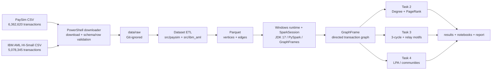

# GraphGuard AML — Distributed Transaction-Graph Analytics

GraphGuard là dự án Big Data xây dựng đồ thị giao dịch có hướng từ hai bộ dữ liệu tài chính tổng hợp, sau đó phân tích **Degree/PageRank**, **Motif Finding** và **Community Detection** bằng **PySpark 3.5.1 + GraphFrames 0.12.2**. Dự án tập trung vào khả năng tái lập trên Windows, tính toàn vẹn của graph và cách diễn giải thận trọng: kết quả graph tạo danh sách cần điều tra, không tự động chứng minh gian lận hay rửa tiền.

## Kiến trúc



## Trạng thái và phạm vi

Mốc hiện tại là **N4 toy motif ngày 21/09/2026**. Demo `A → B → C → A`, PowerShell runtime và notebook đã có thể chạy độc lập. Các module PaySim/IBM cho Task 2–4 đã được đặt đúng vị trí để phối hợp nhóm, nhưng những file có `TODO` vẫn là scaffold theo lịch phân công; README này không coi các deadline sau 21/09 là đã hoàn thành.

Hai dataset được dùng:

| Dataset | Vai trò | File local | Ghi chú |
|---|---|---|---|
| [PaySim](https://www.kaggle.com/datasets/ealaxi/paysim1) | Dataset chính; fraud trong mobile-money simulation | `data/raw/paysim/PS_20174392719_1491204439457_log.csv` | 6,362,620 giao dịch; `step` là giờ mô phỏng |
| [IBM Transactions for AML](https://www.kaggle.com/datasets/ealtman2019/ibm-transactions-for-anti-money-laundering-aml) | Mở rộng để phân tích cycle/typology AML | `data/raw/ibm_aml/HI-Small_Trans.csv` | Chỉ tải biến thể **HI-Small**, không tải toàn bộ archive |

Raw CSV và full Parquet không được commit. Hãy đọc điều khoản/license trên trang nguồn trước khi sử dụng hoặc chia sẻ dữ liệu.

## Cài đặt trên Windows PowerShell 5.1+

Yêu cầu bắt buộc: **Windows Python 3.12**, **JDK 17**, Git và dung lượng trống tối thiểu khoảng 2 GB cho raw CSV cùng file tạm. Repo hỗ trợ đường dẫn có khoảng trắng và tiếng Việt; không cần activate virtual environment.

```powershell
# Chạy PowerShell tại thư mục muốn chứa project
git clone https://github.com/harvey105/graphguard-amls-detection.git
Set-Location '.\graphguard-amls-detection'

# Nếu máy chưa có Python/JDK
winget install --id Python.Python.3.12 --exact
winget install --id EclipseAdoptium.Temurin.17.JDK --exact

# Tạo .venv, cài requirements và Hadoop 3.3.4 native tools có kiểm SHA256
powershell.exe -NoProfile -ExecutionPolicy Bypass -File .\scripts\setup_windows.ps1
```

`setup_windows.ps1` luôn dùng `.venv\Scripts\python.exe`, kiểm tra Python 3.12, JDK 17, `pip check`, và cài đúng phiên bản trong `requirements.txt`. Nếu vừa cài JDK/Python bằng `winget`, hãy mở một cửa sổ PowerShell mới trước khi setup.

## Tải và kiểm tra hai datasets

Script dùng `kagglehub` từ `.venv`, chỉ tải hai CSV mà pipeline cần, rồi kiểm tra dung lượng, header và số dòng. Public dataset thường tải được không cần đăng nhập; nếu Kaggle yêu cầu consent/xác thực, tạo token tại Kaggle Settings và đặt `$env:KAGGLE_API_TOKEN` trước khi chạy.

```powershell
# Tải cả PaySim và IBM AML HI-Small, sau đó tự kiểm tra
powershell.exe -NoProfile -ExecutionPolicy Bypass -File .\scripts\download_datasets.ps1

# Chỉ kiểm tra lại dữ liệu đã có, không truy cập mạng
powershell.exe -NoProfile -ExecutionPolicy Bypass -File .\scripts\download_datasets.ps1 -VerifyOnly

# Tải/kiểm tra riêng từng dataset khi cần
powershell.exe -NoProfile -ExecutionPolicy Bypass -File .\scripts\download_datasets.ps1 -Dataset PaySim
powershell.exe -NoProfile -ExecutionPolicy Bypass -File .\scripts\download_datasets.ps1 -Dataset IbmAml

# Chủ động tải lại bản sạch
powershell.exe -NoProfile -ExecutionPolicy Bypass -File .\scripts\download_datasets.ps1 -Force
```

Kết quả hợp lệ kết thúc bằng `All selected datasets passed verification.` và các dòng `[PASS]` tương ứng. Chi tiết manifest nằm tại `data/raw/README.md`.

## Chạy và kiểm chứng mốc N4

```powershell
# Chạy module toy motif và execute lại notebook bằng Windows .venv
powershell.exe -NoProfile -ExecutionPolicy Bypass -File .\scripts\run_n4.ps1

# Kiểm tra dependency độc lập
& .\.venv\Scripts\python.exe -m pip check
```

Mở `notebooks/02_n4_toy_motif.ipynb` trong VS Code và chọn interpreter `.venv\Scripts\python.exe`. Kết quả mong đợi: 3 raw motif matches do ba phép xoay, tương ứng 1 chu trình duy nhất.

Task 1 PaySim sample hiện có thể gọi bằng:

```powershell
& .\.venv\Scripts\python.exe -m src.paysim.graph_analysis --sample
```

## Cấu trúc repository và phân công code

```text
graphguard-amls-detection/
├── .agents/skills/graphguard-powershell/  # Quy ước workflow Windows của team
├── data/
│   ├── raw/                               # CSV tải local, Git-ignored
│   │   ├── paysim/                        # PS_201743..._log.csv
│   │   └── ibm_aml/                       # HI-Small_Trans.csv
│   └── processed/sample/paysim/           # Sample vertices/edges Parquet đã track
├── docs/                                  # Part A/B, handoff và báo cáo N4
├── notebooks/
│   ├── 01_dataset_exploration.ipynb       # Khám phá dữ liệu
│   └── 02_n4_toy_motif.ipynb              # N4 toy 3-cycle, mốc 21/09
├── results/
│   ├── motif/toy_cycle_summary.json       # Bằng chứng máy đọc được của N4
│   └── paysim/                            # Log/kết quả pipeline PaySim
├── scripts/
│   ├── setup_windows.ps1                  # Python 3.12 + deps + Hadoop native tools
│   ├── download_datasets.ps1              # Tải và verify đúng 2 raw CSV
│   ├── run_n4.ps1                         # Entry point PowerShell cho demo N4
│   └── run_n4_notebook.py                 # Execute notebook bằng Windows kernel
├── src/
│   ├── common/
│   │   ├── spark_session.py               # N2: Spark/GraphFrames session dùng chung
│   │   ├── windows_runtime.py              # JAVA/Hadoop/Python/subst cho Windows
│   │   └── graph_utils.py                  # Helper load/save/validate graph
│   ├── motif/toy_cycle.py                  # N4: demo graph.find 3-node cycle
│   ├── paysim/
│   │   ├── etl_mapping.py                 # N2: raw PaySim -> vertex/edge schema
│   │   ├── export_parquet.py              # Xuất graph PaySim ra Parquet
│   │   ├── graph_analysis.py               # N1: Task 1 construction + integrity
│   │   ├── metrics.py                      # N6: Task 2, lịch 30/09–04/10
│   │   ├── motif_finding.py                # N4: Task 3, lịch 30/09–04/10
│   │   └── community_detection.py          # N5/N6: Task 4, lịch 29/09–04/10
│   └── ibm_aml/
│       ├── etl.py                          # N2: IBM ETL, lịch 27–30/09
│       ├── metrics.py                      # N6/N3: IBM Task 2, lịch 01–07/10
│       ├── motif_finding.py                # N4/N5: IBM Task 3, lịch 01–07/10
│       └── community_detection.py          # N5/N4: IBM Task 4, lịch 01–07/10
├── tests/                                  # Kiểm tra mapping vertices/edges Task 1
├── requirements.txt                        # Dependency pin cho Python 3.12
└── README.md
```

Ánh xạ trên được tổng hợp từ file phân công local `BDA - PCCV - Trang tính1.csv`. File CSV này là tài liệu điều phối nội bộ và được `.gitignore`; các ngày trong cây là deadline/ownership, không phải cam kết rằng scaffold đã hoàn thiện. Mốc tích hợp báo cáo là 19–24/10/2026 và hạn nộp là 26/10/2026.

## Quy ước phát triển

- Python chứa ETL và thuật toán; PowerShell là entry point setup/run/verify của team.
- Chạy bằng `& .\.venv\Scripts\python.exe ...`; không dùng kết quả WSL làm bằng chứng Windows.
- Không commit raw dataset, full processed Parquet, `.venv`, Spark warehouse hoặc checkpoint.
- LPA/Connected Components phải cấu hình checkpoint qua `src/common/spark_session.py`.
- `PageRank cao ≠ fraud` và một motif/community chỉ là tín hiệu điều tra; luôn đối chiếu nhãn, thời gian, amount và giới hạn dataset.

## Tài liệu chính

- `docs/N4_Motif_Toy_2026-09-21.md`: demo và kết quả motif N4.
- `docs/PartA_Theory.md`: nền tảng GraphX/GraphFrames, partitioning, PageRank, CC/LPA.
- `docs/HANDOFF_2026-09-20_Refactor.md`: thay đổi layout và import paths.
- `AGENTS.md`: quy ước làm việc trong repository.
